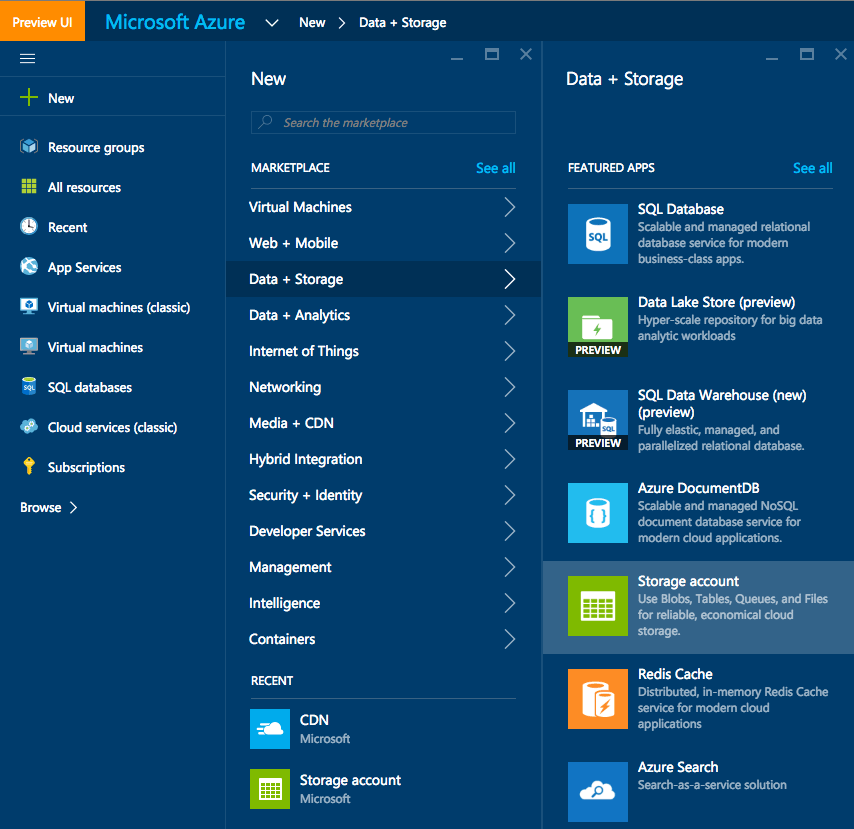
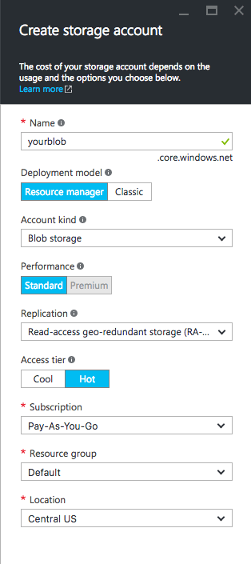
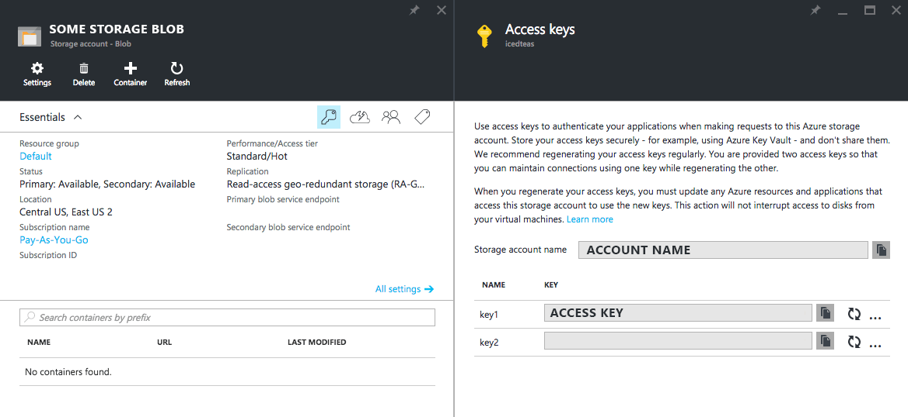
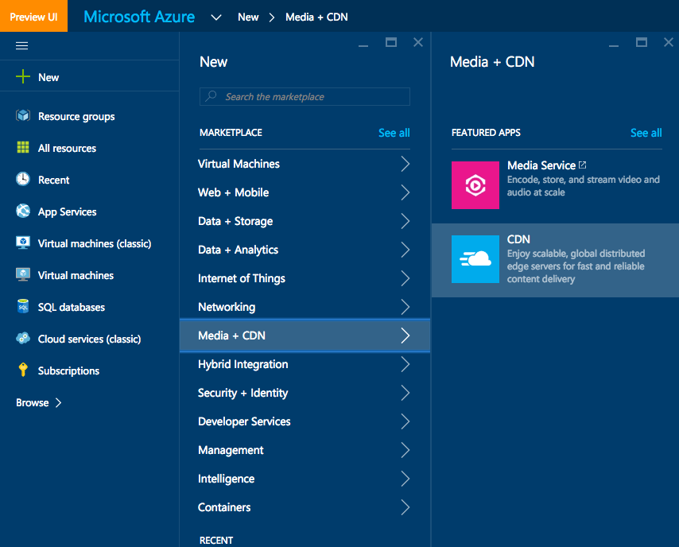
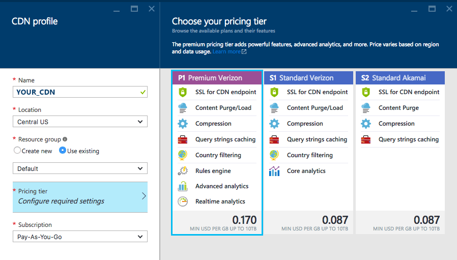
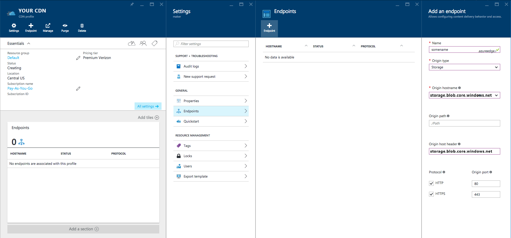
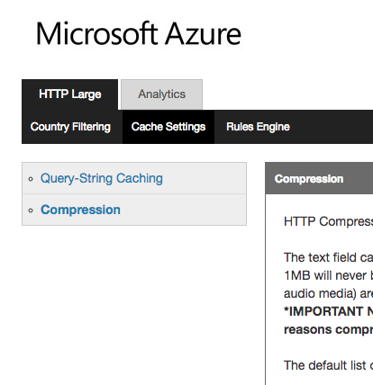

# Azure Blob Setup

#### I. Create a new storage account from https://ms.portal.azure.com

  

#### II. Setup as blob storage

  

#### III. Grab your keys and account name for the `.yokairc` config file
Leave the container blank if you would like to use the root container
  

#### IV. Clean / Pretty URLs
Note that Azure blob storage [does not have a default document](https://feedback.azure.com/forums/217298-storage/suggestions/1180039-support-a-default-blob-for-blob-storage-containers#comments) like `index.html` so you'll need to configure a CDN to make that work.

- Create a new CDN

- Select **P1 Premium Verizon** with **Rules Engine**

- Link your storage account to the cdn

- Click the **manage** button to launch the verizon tool to edit rewrite rules

  - add a new rule **IF Always**
     - **Feature**
      - **URL Rewrite** - source `((?:[^\?]*/)?)($|\?.*)` destination `$1index.html$2`
      - **URL Rewrite** - source `((?:[^\?]*/)?[^\?/.]+)($|\?.*)` destination `$1.html$2`

The CDN takes time to populate, may take up to 4 hours.

#### V. COMPRESSION
Enable compression from the edgecast console:

#### VI. CNAME
